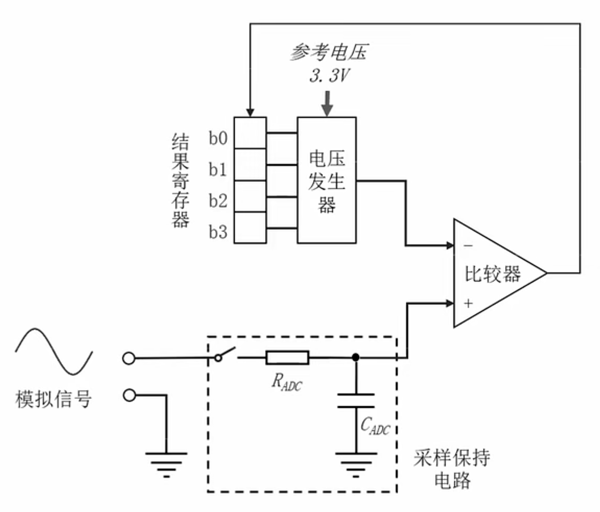
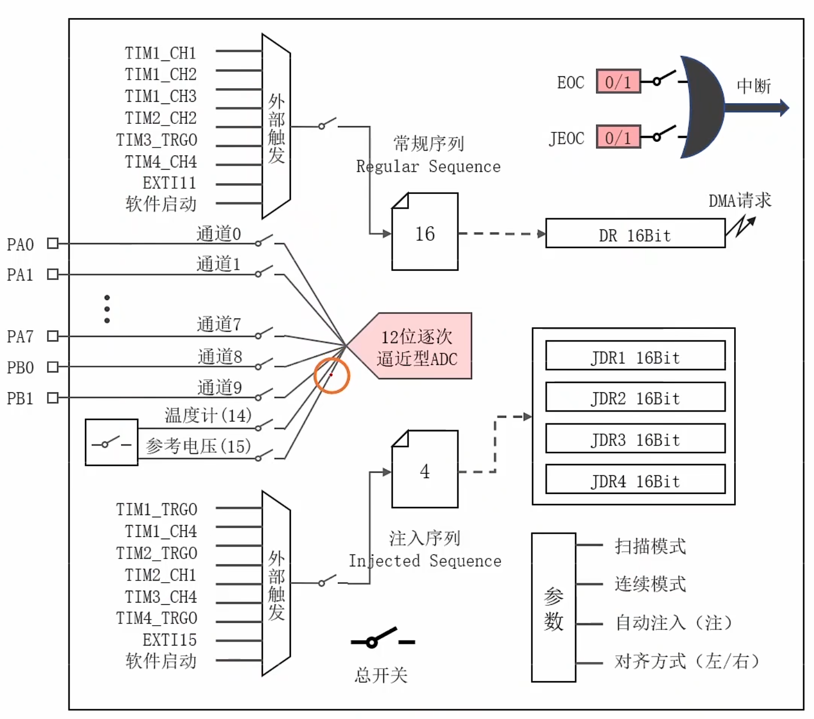
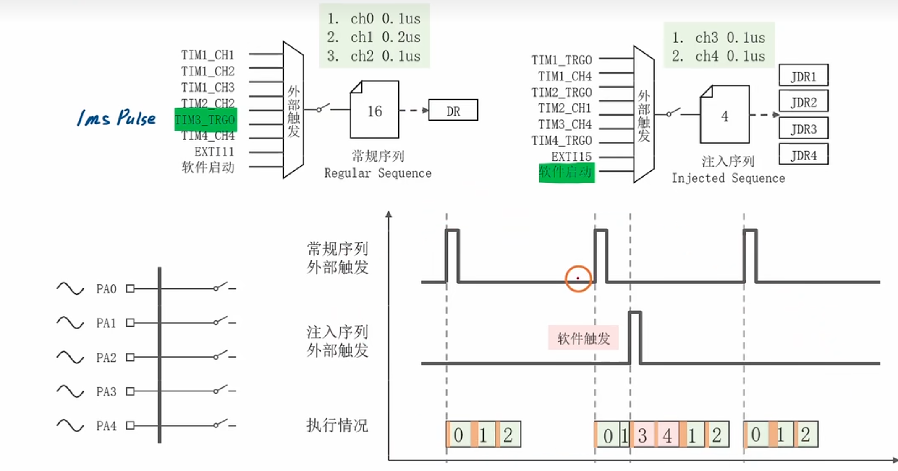
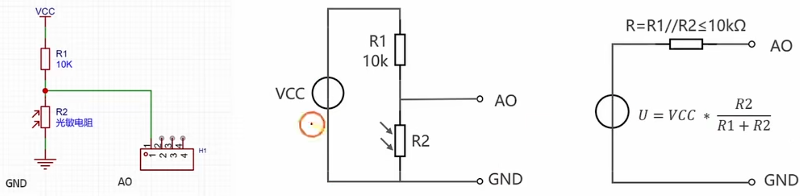
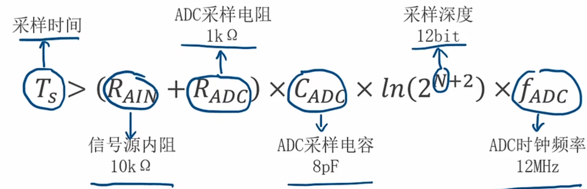

# 
**1O.1[ADC]逐次逼近型ADC**

## 1.ADC是什么

- Analog(模拟信号)Digital(数字信号)Converter(转换器)
- 模拟信号:存在于自然界当中，时间连续、幅度也连续(即数值的精度无限)，如某地一天的气温变化
- 数字信号:存在于计算机当中时间离散、幅度也离散，如气象站当日气温记录
- 本章所学习的是将自然界的电压信号转化为数字信号

## 2.单片机里的ADC模块

- 12位逐次逼近型ADC:ADC1、ADC2

## 3.采样深度的概念

- 采样深度:用多少位二进制数表示转换结果
- 4位ADC:0000~1111即(3.3-0)/15=0.22V即2V大约1001b*0.22V=1.98V即有0.02V量化误差，如果使用无限的长度二进制数去表示转换结果，那么这个量化误差会趋于0

## 4.逐次逼型ADC简介

- 逐次逼型ADC:
- 比较器:如果正输入比反输入大,输出1，反之输出0
- 这里结果寄存器采样深度为4,B3代表最大的砝码,B0代表最小的砝码

## 5.采样保持电路

- 在模拟信号中取样下来,在正输入端保持电压不变
- 采样时闭合开关,给电容充电,电容饱和时断开开关,这时电容无法向外放电,电压保持不变

## 6.例子

*****
 
# 
**10.2[ADC]ADC模块的结构框图**

- ADC模块的结构框图:
- 将逐次逼近型ADC的采样开关往前提

## 1.ADC的多路复用

- 多路复用:只使用一个ADC但同时转换多路模拟信号
- 通道0 ~ 9分别对应10个普通IO引脚分别是PA0 ~ PA7、PB0、PB1

## 2.常规序列

- Regular Sequence
- 常规序列右边为DR寄存器，结果存储在DR寄存器中
- 常规序列即ADC的一份计划，16表示该计划有16行,只能填16项计划，有先后顺序,以及有闭合的时间
- 常规序列左边是外部触发信号，当其出上升沿时常规序列会执行一遍

## 3.注入序列

- Injected Sequence
- 1.通道更少即只能写4个计划
- 2.每个通道有单独的结果寄存器
- 3.比常规序列优先级更高

## 4.例子

- 例子:

*****

# 
**10.3[ADC]采样时间和转换时间**

- 采样时间:开光闭合的时间长度
- 转换时间：对采样点进行转换所消耗的时间

## 1.ADC的时钟频率

- ADC的输入时钟不得超过14MHZ(默认情况PCLK2=72MHZ/6=12MHZ)

## 2.转换时间的计算方法

- 12位逐次逼近型ADC,每个砝码都要尝试一遍，即12次，一次一个周期1cycle=1/12MHZ=0.083us,转换时间=12cycle+0.5cycle(额外周期)=12.5cycle大约1.04us

## 3.采样时间和信号源内阻的关系

- 信号源内阻越大采样时间越长

## 4.信号源内阻的计算方法

- 光敏传感器模块通过AO引脚输出模拟信号
- 信号源内阻的计算方法:

## 5.采样时间的计算方法

- 采样时间的计算方法:
- 算出来单位是cycle 10.24cycle

*****

# 
**10.4[ADC]常规单通道转换**

- 板载LED来放映光照强度,光照强度高时点亮,光照强度低时xi
